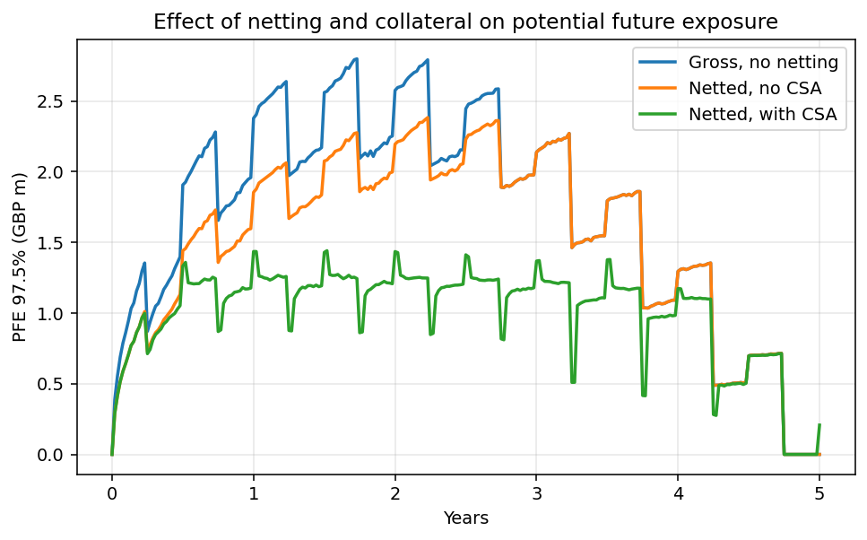

# Counterparty Credit Exposure and CVA Engine

Monte Carlo counterparty credit risk on a two-trade interest rate swap netting set:
simulated exposure profiles (EE, EPE, EEPE, PFE), the effect of netting and a CSA,
CVA priced off a bootstrapped hazard rate curve, and a wrong-way risk stress.

Everything is built from first principles in NumPy and SciPy. There is no
pricing library dependency.



## Headline results

10,000 paths, weekly grid, 5 year horizon.

| Metric | Gross | Netted | Netted + CSA |
| --- | --- | --- | --- |
| EPE | GBP 398k | GBP 280k | GBP 227k |
| Effective EPE | GBP 431k | GBP 257k | GBP 237k |
| Peak PFE (97.5%) | GBP 2.80m | GBP 2.38m | GBP 1.44m |

- Netting reduces peak PFE by **14.9%**.
- The CSA reduces peak PFE by a further **39.5%**, from GBP 2.38m to GBP 1.44m.
  The residual is the GBP 1m threshold plus gap risk over the 10 business day
  margin period of risk, which is the correct floor and not a modelling artefact.
- CVA falls from **3.65bp** of notional uncollateralised to **2.93bp** with the CSA.
- Under a wrong-way risk tilt of beta = 100, CVA rises **161%** to GBP 47.6k.

## Portfolio and terms

| | |
| --- | --- |
| Trade 1 | 5y GBP payer swap, GBP 50m notional, struck at par (4.2444%) |
| Trade 2 | 3y GBP receiver swap, GBP 20m notional, struck at par |
| Legs | Floating quarterly, fixed semi-annual |
| CSA | Two-way, GBP 1m threshold, GBP 250k MTA, 10 business day MPoR |
| Counterparty | BBB industrial, CDS 90 / 130 / 150bp at 1y / 3y / 5y, 40% recovery |

## Model

**Short rate.** One-factor Hull-White, `dr = (theta(t) - a r) dt + sigma dW`, with
a = 0.05 and sigma = 75bp absolute. Simulated with an exact-moment scheme so the
discretisation does not bias the drift. Bond prices use the affine form
`P(t,T) = A(t,T) exp(-B(t,T) r(t))`.

**Swap MTM.** Floating fixings are stored per path at each quarterly reset, so the
swap can be valued at any point on the weekly grid rather than only on reset dates.
That matters: without it, a 10 business day margin period of risk cannot be
represented at all, and the collateral model collapses to something meaningless.

**Collateral.** Collateral held at time t is based on the netting set value observed
one MPoR earlier, since that is the last margin call that could have settled before
close-out. The minimum transfer amount makes the balance sticky, so a call is only
made when the required balance moves by at least the MTA.

**Credit.** Piecewise-constant hazard rates bootstrapped tenor by tenor from the CDS
term structure with Brent's method, each solved to set the CDS par value to zero.
Bootstrapped hazards are 1.50% / 2.53% / 3.08%.

**Wrong-way risk.** The hazard rate is tilted path-wise by `exp(beta (r(t) - r0))`,
renormalised at each time step so the marginal default probability still matches the
calibrated curve. Any change in CVA is therefore attributable to the correlation
between exposure and default, not to a shifted default probability. For a payer
swap, positive beta is wrong-way: rates rise, exposure rises, and the counterparty
becomes more likely to default at exactly that moment.

## Reading the exposure profile

The sawtooth in the PFE chart is not noise. Each quarterly floating payment and
semi-annual fixed payment strips value out of the netting set, so exposure drops on
payment dates and rebuilds through the accrual period. The larger step down at 3
years is the receiver swap maturing and the netting benefit disappearing with it.
The profile peaks around 1.7 to 2.2 years, the standard trade-off between diffusion
of the rate factor and amortisation of the remaining cashflows.

## Running it

```bash
pip install -r requirements.txt
python run.py --paths 10000 --seed 42
```

Writes `outputs/results.json` and four charts. Runtime is about 30 seconds for
10,000 paths on a laptop.

## Layout

```
src/hull_white.py    short rate simulation, affine bond prices
src/swap.py          swap schedules, par rates, path-wise MTM
src/exposure.py      EE, EPE, EEPE, PFE, gross vs netted
src/collateral.py    CSA with threshold, MTA and margin period of risk
src/credit.py        CDS bootstrap, CVA, wrong-way risk
run.py               end to end run and charts
```

## Known limitations

- Flat initial zero curve. A real desk strips OIS and the theta(t) term is no longer
  closed form in this shape.
- One factor, so all rate moves are perfectly correlated across tenors. Curve
  reshaping risk is not captured.
- Unilateral CVA only. No DVA, no FVA, no collateral funding cost.
- Constant recovery at 40%, and no correlation between recovery and default.
- The wrong-way tilt is a reduced-form device, not a calibrated joint model.
